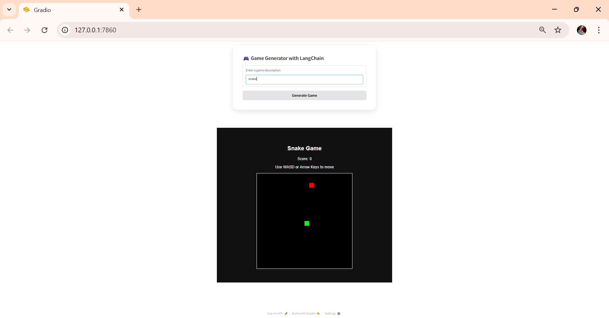
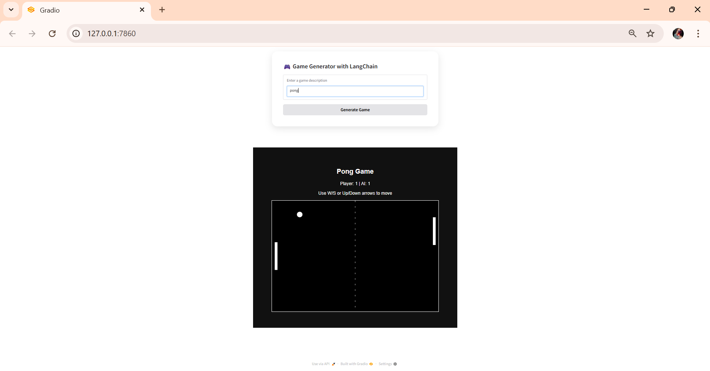
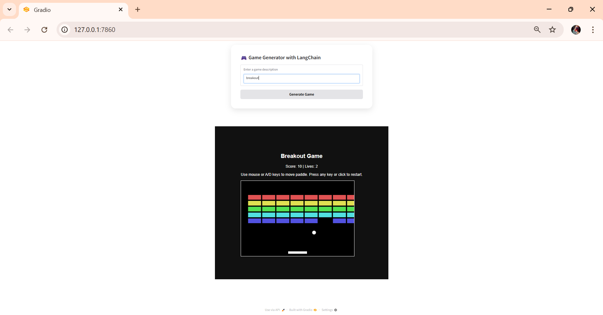
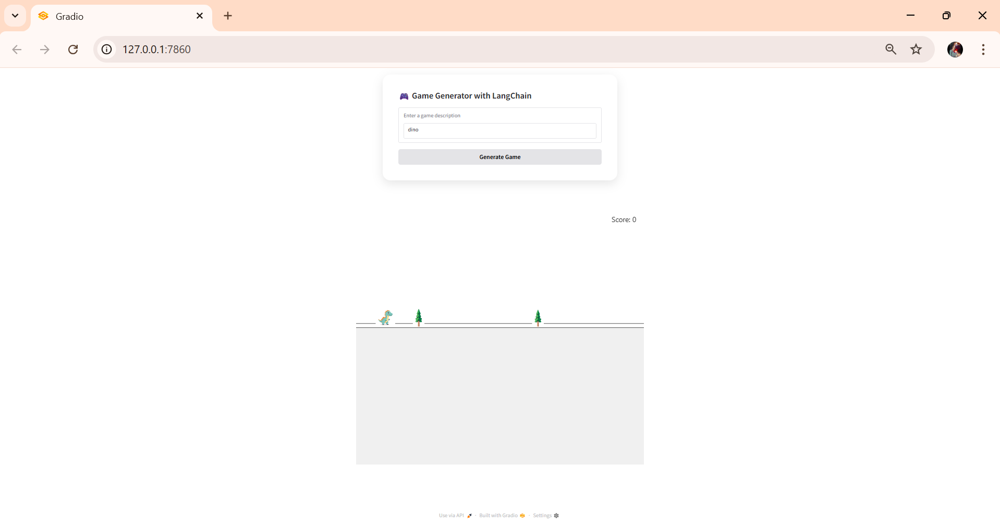
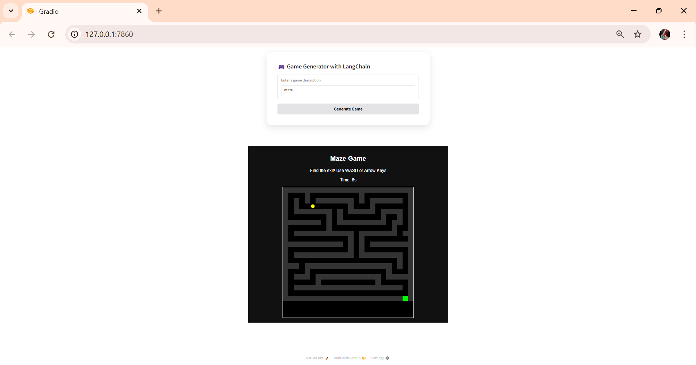

# 🎮 Game Generator with LangChain and Gradio

This project is a fun, interactive game generator that takes a simple game description (like "snake", "flappy bird", etc.) and launches a playable browser game using Gradio and LangChain.

## 📸 Screenshots

### 🎯 Game Generator Interface


### 🐍 Snake Game


### 🏓 Pong Game


### 🐤 Flappy Bird


### 🧱 Breakout Game


### 🌲 Dino Game


### 🧩 Maze Game


### 🖱️ Clicker Game


## 🚀 Features

- Generates games like:
  - Snake
  - Pong
  - Flappy Bird
  - Dino Game
  - Maze Game
  - Breakout
  - Simple Clicker
- Uses LangChain + OpenAI LLM (optional) for smarter game suggestions.
- Clean Gradio UI with iframe game previews.
  
## 📦 Requirements

See `requirements.txt` for dependencies.

## 📄 License

This project is licensed under the [MIT License](LICENSE).

## 🔑 Setup

```bash
# 1. Clone the repo
git clone https://github.com/your-username/game-generator.git
cd game-generator

# 2. Install dependencies
pip install -r requirements.txt

# 3. Set your OpenAI API Key (optional but recommended)
export OPENAI_API_KEY='your-key-here'

## 🔑 How to Get an OpenAI API Key (Optional)

To enable AI-powered game suggestions (like automatic detection of game type from your description), you can use the OpenAI API via LangChain.

Follow these steps:

1. Go to [https://platform.openai.com/account/api-keys](https://platform.openai.com/account/api-keys)
2. Sign in or create an OpenAI account
3. Click **“Create new secret key”**
4. Copy the key (starts with `sk-...`)


# 4. Run the app
python app.py
